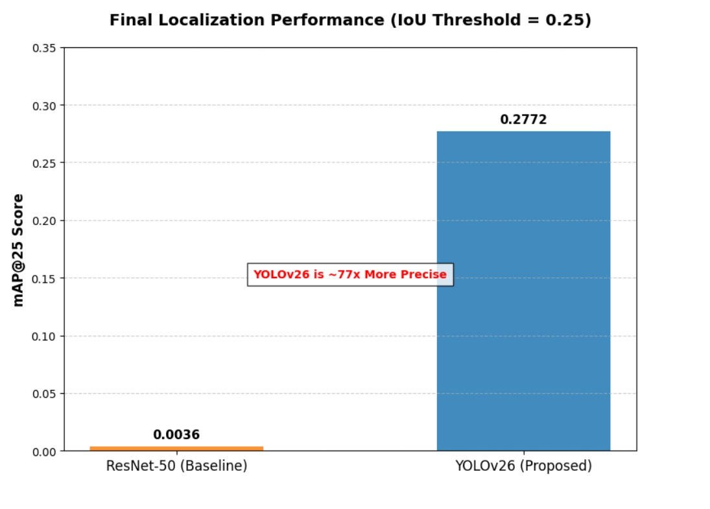
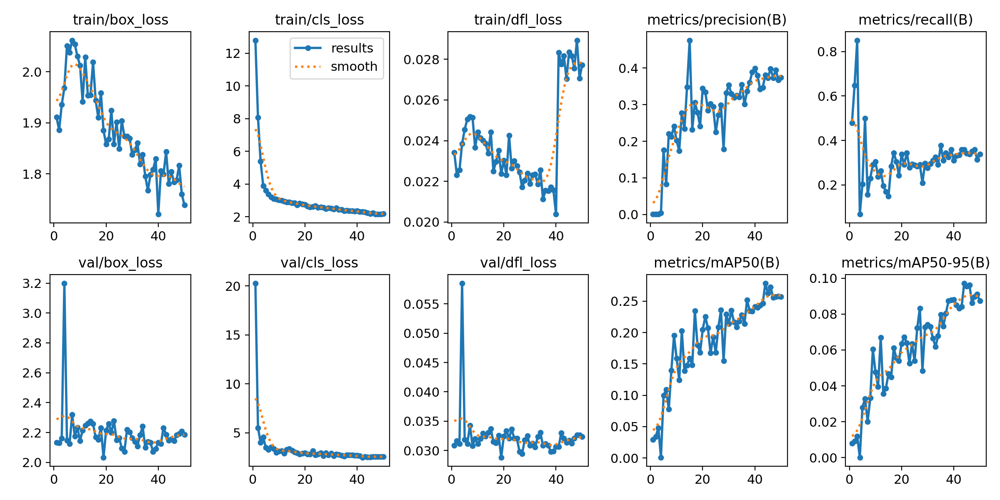
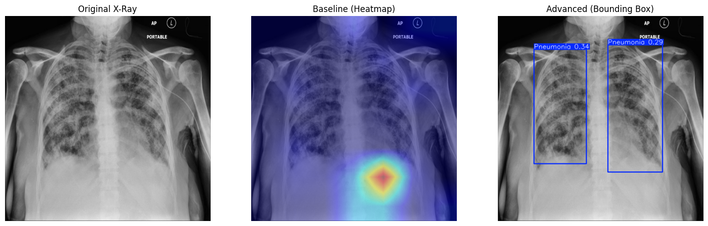
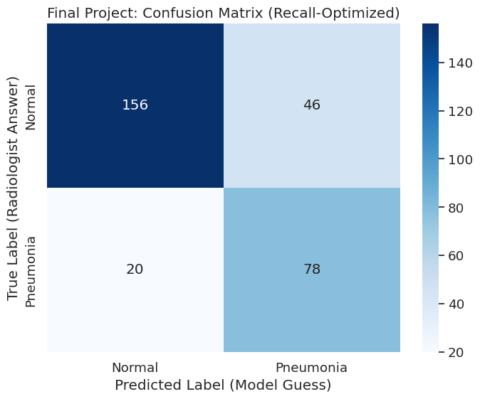
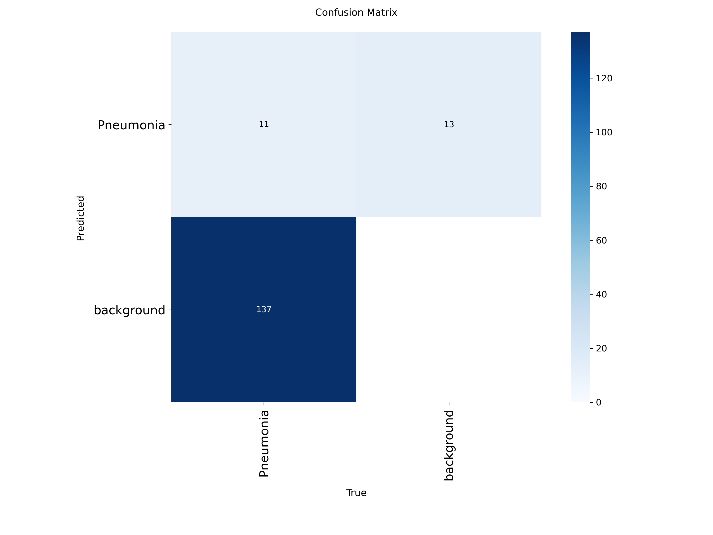
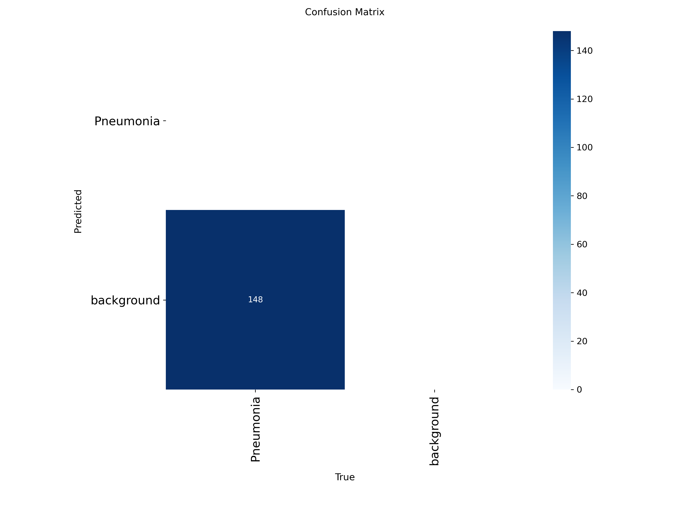

# Deep Learning for Pneumonia Localization in Chest X-Ray

A comparative study between dedicated Object Detection (YOLOv26) and Heatmap-based (ResNet-50 + Grad-CAM) architectures for localizing pulmonary opacities.

## 📌 Project Overview

Pneumonia remains a leading cause of global mortality, requiring rapid and accurate spatial interpretation. While AI classification models can identify the presence of infection, they often lack the spatial precision required for clinical decision-making. This capstone project evaluates whether the specialized detection loss in **YOLOv26** yields superior localization compared to saliency-based heatmaps derived from a traditional **ResNet-50** CNN.

## 🎯 Research Question

How does a dedicated Object Detection architecture (YOLOv26) compare to a traditional CNN Classification model (ResNet-50) using Grad-CAM heatmaps in accurately localizing pulmonary opacities?

## 📊 Dataset & Methodology

- **Dataset**: [RSNA Pneumonia Detection Challenge](https://kaggle.com) (Stage 2 labels).
- **Prototyping**: Stratified subset of 2,000 images (300-image validation set).
- **Preprocessing**: DICOM to JPEG conversion, Adaptive Histogram Equalization (CLAHE), and coordinate scaling.
- **Baseline Model**: ResNet-50 Binary Classifier with Grad-CAM localization.
- **Proposed Model**: YOLOv26 (Nano), an end-to-end detector optimized for spatial regression.

## 📈 Primary Results: The 77x Performance Gap

To ensure a rigorous "apples-to-apples" comparison, both models were evaluated at a relaxed **IoU threshold of 0.25 (mAP@25)** to accommodate the diffuse nature of Grad-CAM heatmaps.

| Metric               | ResNet-50 (Baseline) | YOLOv26 (Proposed) | Improvement |
| :------------------- | :------------------: | :----------------: | :---------- |
| **mAP@50 (Strict)**  |        0.0000        |     **0.278**      | -           |
| **mAP@25 (Relaxed)** |        0.0036        |     **0.277**      | **~77x**    |

### Performance Visualizations

  
_Figure 1: Visualizing the massive localization gap between classification-based and detection-based models._

  
_Figure 2: YOLOv26 training curves showing stable convergence of box and classification loss._

## 🧪 Model Architecture Benchmark (The Transformer Paradox)

We further benchmarked YOLOv26 against a Transformer-based detector (**RT-DETR-L**) to determine if global attention mechanisms would yield better clinical results.

| Model Architecture     | Precision |  Recall   |   mAP50   | Observation                      |
| :--------------------- | :-------: | :-------: | :-------: | :------------------------------- |
| **YOLOv26 (Standard)** | **0.382** |   0.358   | **0.278** | **Best All-Rounder (Balanced)**  |
| **RT-DETR-L**          |   0.015   | **0.514** |   0.058   | High Recall / Unusable Precision |

> **Key Finding**: While RT-DETR had high recall, its extremely low precision resulted in excessive false positives, proving that convolutional "local" biases are currently superior to "global" transformers for subtle medical textures.

## 🔍 Error Analysis & Qualitative Comparison

Our analysis revealed that the numerical accuracy of the ResNet-50 baseline was driven by **Shortcut Bias**.

  
_Figure 3: Grad-CAM reveals ResNet-50 focused on the abdominal region to predict pneumonia, while YOLOv26 correctly localized the pulmonary opacities._

### Confusion Matrices

|       ResNet-50 (Bias Risk)        |       YOLOv26 (Reliable)       |          RT-DETR (Failure)          |
| :--------------------------------: | :----------------------------: | :---------------------------------: |
|  |  |  |

- **ResNet-50**: High hits, but spatially invalid (looks at the abdomen).
- **YOLOv26**: Functional differentiation between pathology and background.
- **RT-DETR**: Functional collapse; predicted almost all instances as background.

## 🏥 Clinical Impact Statement

The transition from broad heatmaps to precise bounding boxes represents a shift from "black-box" AI to a functional clinical tool.

- **Explainable AI (XAI)**: Provides clear, interpretable evidence for a diagnosis.
- **Workflow Optimization**: Reduces search time for radiologists in high-volume settings.
- **Safety**: Minimizes "shortcut learning" risks by enforcing spatial constraints during training.

## 🛠️ Installation & Reproducibility

Due to the large size of medical data, weights and datasets are managed via Google Drive and Kaggle API.

### ⚖️ Model Weights

Best weights of trained models :-

- **YOLOv26 (Best)**: https://drive.google.com/file/d/1L76Y-T677IWmu0xcnyb1OysOB5lq9kft/view?usp=sharing
- **RT-DETR (Benchmark)**: https://drive.google.com/file/d/1F1cb3TCBWAlgFOXOe9FSkbX24GH3ix8E/view?usp=sharing
- **Resnet50**: https://drive.google.com/file/d/1io9GWGWYCSWMmO5gDfDDnw28P1rGUgTd/view?usp=sharing

Please download these files and replace corresponding reference in the evaluation notebook

1. **Clone & Install**:
   ```bash
   git clone https://github.com/Rivier-Computer-Science/SP25-690-Reddy.git
   pip install -r requirements.txt
   ```
2. **Data Setup**: Ensure your Kaggle API key is configured. Notebooks include automated download/unzip cells.
3. **Run Evaluation**: Execute `notebooks/Validation_Comparative_Analysis.ipynb` to reproduce mAP results.

## 📜 Conclusion

Traditional classification heatmaps (Grad-CAM) provide insufficient spatial precision (**0.0036 mAP@25**) and are prone to artifact-based shortcut learning. **YOLOv26** emerged as the optimal architecture, providing a **77-fold improvement** over the baseline and establishing a stable foundation for high-precision medical diagnostics.

---

**Medical Disclaimer:** This research is for educational purposes only and is not intended for clinical use, diagnosis, or treatment. All AI findings must be verified by a qualified medical professional according to official clinical standards.
